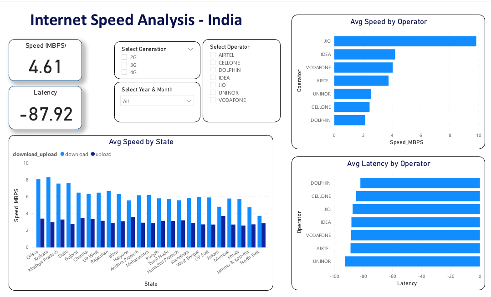

# Data Engineering Portfolio

## Invoice Management Pipeline in Azure
Portfolio project for invoice management pipeline using Azure services.

This portfolio project is implemetation demostrate the invoice management pipeline to precess invoices from multiple sources and made available to azure SQL database.

Technologies used - 
-  Azure Data Factory
-  Data Lake storage Gen 2
-  SFTP using AWS transfer
-  MongoDB Atlas
-  ORACLE DB
-  Azure Event Hub
-  Stream Analytics 
-  Azure SQL Database

## Analyzing internet Speed Data in India Using Apache Spark
Internet Speed analysis in India using Apache Spark

Speed analysis data from TRAI is extracted and analyzed using apache spark. The transformed dataset from azure databricks is stored in Azure Blob.  
Data analysis and vizualization on the transformed data is done using Power BI.

