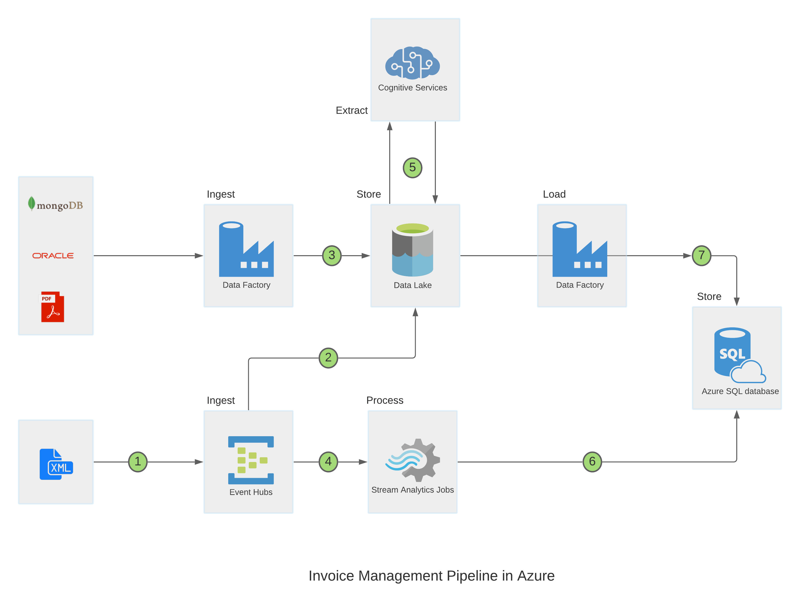

# Invoice Management Pipeline in Azure
Portfolio project for invoice management pipeline using Azure services.

This portfolio project is used to ingest invoice data from multiple sources and made available to azure SQL database.

Technologies used - 
-  Azure Data Factory
-  Data Lake storage Gen 2
-  SFTP using AWS transfer
-  MongoDB Atlas
-  ORACLE DB
-  Azure Event Hub
-  Stream Analytics 
-  Azure SQL Database

## Extract and Load - 
### Oracle Database - 
Invoice data from on premise Oracle DB table is ingested using azure data factory lookup and Data copy functionality. The table fileds are mapped with the destination azure DB staging table.

### MongoDB Database - 
Invoice JSON from mongoDB atlas is ingested using azure copy tool and stored to azure datalake storage Gen 2.

### SFTP server - 
Invoice PDF images are create from csv for testing purpose. SFTP server is created using AWS Tranfer and S3 service. Data copy tool within azure data factory is used to copy the PDF files from AWS SFTP to data lake. SSH private and public key authentication is used to connect to the server with the created SFTP user. Once the invoice is successfully transferred to the azure it is deleted from the SFTP server.

### Streaming XML invoices - 
Demo XML are created using the invoice data in the CSV files. Azure event hub instance is used to ingest the streaming xml data. Streaming XML data is created using a python script by connecting to the event hub endpoint. One serialized XML is send to the end point in each batch.      

The event hub is output is consumed using streaming analytics. Streaming analytics consumes the input XML from event hub and transforms the data and store it into the Azure database staging table.

 

## Transform

### JSON Invoices -
Invoices in JSON format are transformed using the stored procedure. This stored procedure is executed after successful import of the JSON invoices. Stored procedure takes the XML output from the previous stage of the pipeline, process the JSON and inserts into the azure invoice staging table.   

### PDF Invoices - 
After PDF invoices are available in the datalake an azure function is called. The azure function takes the output from the previous stage of the pipeline and triggeres the Form recogninzer cognitive service. The form recognizer service returns the output as a JSON which is further processed using stored procedure and inserted into azure staging database.

## Vizualization
The invoice count is monitored using a Power BI dashboard.(in progress)

 
