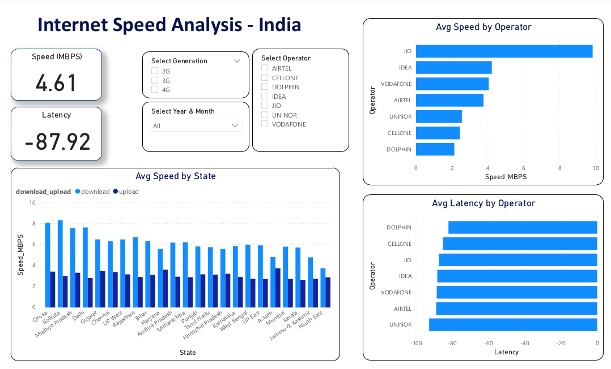

# Analyzing internet Speed Data in India Using Apache Spark
Internet Speed analysis in India using Apache Spark

Speed analysis data from TRAI is extracted and analyzed using apache spark. The transformed dataset from azure databricks is stored in Azure Blob.  
Data analysis and vizualization on the transformed data is done using Power BI.